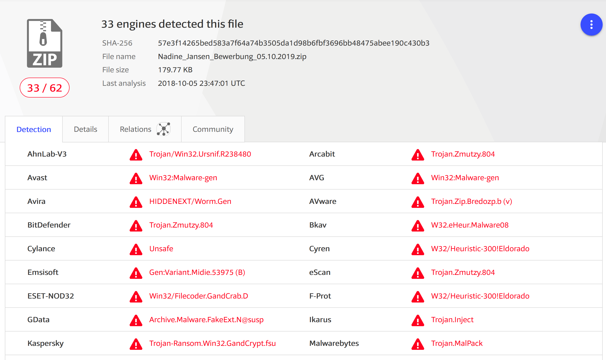

# Aufgabe 01: VirusTotal 
## Einleitung
VirusTotal ist eine sehr coole Webseite, mit welcher man eine Datei, Word, Excel, ZIP oder auch eine Webseite (URL) auf Viren untersuchen kann. 
* https://www.virustotal.com

## E-Mail mit Virus Anhang
Bei dieser Aufgabe analysieren wir einen echten Virus (ZIP FILE), der per E-Mail versendet wurde. Für diese Übung liegt der Virus auf einer Webseite zum Download bereit. 

## Teilaufgabe 1: URL Scanning
Bei dieser Aufgabe sollst Du den echten Virus überprüfen, der als ZIP File zum Download bereit steht. as heisst, Du musst den Virus nicht auf den Laptop laden, sondern kannst von VirusTotal direkt die URL des ZIP überprüfen lassen. 

1. Öffne den Browser auf Deinem Laptop
2. Öffne die https://www.virustotal.com Seite
3. Klicke auf "URL"
4. Kopiere diesen Virus-URL https://www.bambut.ch/Nadine_Jansen_Bewerbung_05.10.2019.zip ins Eingabefeld bei VirusTotal
5. Lass Virus Total das File scannen
6. Was siehst Du? 

## Teilaufgabe 2: File Download und Upload in VirusTotal
Bitte nutze für diese Teilaufgabe die Hacking-Lab LiveCD. Damit stellst Du sicher, dass Du nicht aus Versehen den Virus auf Deinem PC ausführst und Dich Deinen PC infizierst. Bitte führe folgende Schritte aus

1. Starte die Hacking-Lab LiveCD
2. Melde Dich mit dem Benutzername `hacker` und dem Passwort `compass` an. 
3. Öffne den Browser in der LiveCD (Firefox)
4. Lade mit dem Browser folgende Datei herunter https://www.bambut.ch/Nadine_Jansen_Bewerbung_05.10.2019.zip und speichere die Datei in der LiveCD auf dem Desktop oder im Download Ordner
5. Öffne in einem zweiten Browser Tab die VirusTotal https://www.virustotal.com
6. Lade das ZIP File von Schritt 4 hoch zu VirusTotal
7. Lass VirusTotal die Datei überprüfen. 
8. Was siehst Du? 

