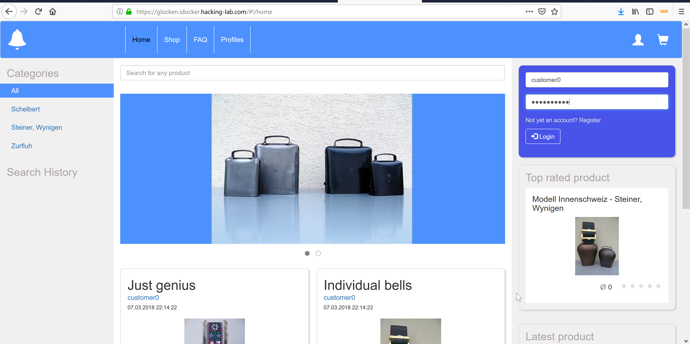

# Aufgabe 02: Web Hacking
## Einleitung
Die meisten Webseiten verlangen ein Passwort. Was versuchen Hacker, die das Passwort nicht kennen? 

1. Passwort erraten (Glück)
2. Passwörter aus einem Wörterbuch nehmen
3. Injection Angriff

## Injection Angriff
In dieser Aufgabe wollen wir das Passwort weder erraten, noch aus dem Wörterbuch raussuchen. Vielleicht findet man das Passwort über diesen Weg auch gar nicht, oder braucht sehr viel Zeit. 

## Teilaufgabe 1: Raten
Versuche einmal ein paar Passwörter aus, die Dir in den Sinn kommen um sich an der Webseite anzumelden. 
* https://glocken.idocker.hacking-lab.com

Wenn Du Glück hast, findest Du das Passwort heraus. Aber falls nicht, kannst Du unten die Teilaufgabe 2 lösen. 

## Teilaufgabe 2: Gültiger Login
Das korrekte Passwort lautet `compass0`. Das hätte man eventuell noch erraten können. Versuch doch mal mit diesem Passwort anzumelden. Du solltest Dich anmelden können. Der Benutzername lautet `customer0'`

## Teilaufgabe 3: Hacking
Wer aber das Passwort nicht kennt und trotzdem eindringen will, kann versuchen einen Hack anzuwenden. Ein Hacker würde folgendes ausprobieren! Falls Du im Shop noch angemeldet bis (aus der Übung davor), dann bitte noch rasch ausloggen. 

* username = `customer0`
* password = `{"$gt":""}`

## Diskussion
Die Zeichen `{"$gt":""}` sind für die Webseite gefährlich und lassen einen Hacker ins System eindringen, obwohl er das Passwort nicht kennt. Die Profis nennen dies "SQL Injection" oder "NoSQL Injection". 

## Absicherung
Der Entwickler des Web Shop hat einen fatalen Fehler begangen. Er muss die gefährlichen Zeichen `{"$gt":""}` rausfiltern. Wenn er das nicht macht, dann wird es gefährlich. 

