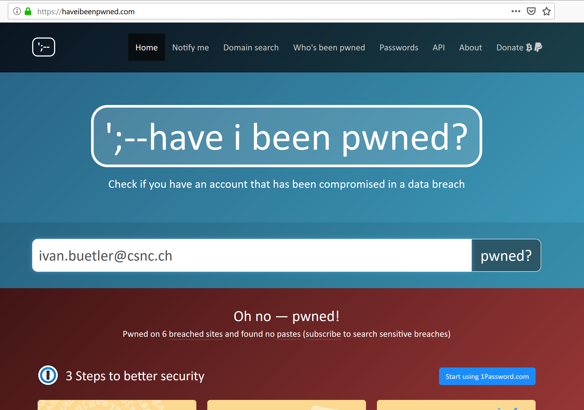
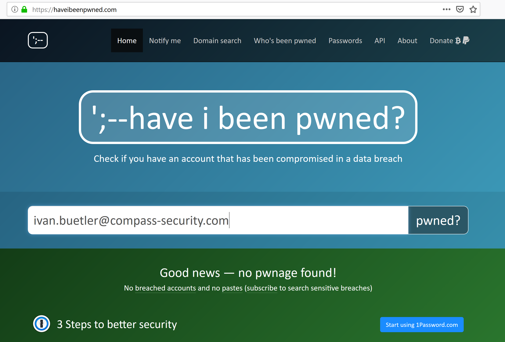

# Aufgabe 03: Wurde meine E-Mail schon gehackt? 
## Einleitung
Vor Kurzem hat das Schweizer Fernsehen darauf hingewiesen, dass das Passwort von ganz berühmten Personen einfach im Internet auffindbar sind. Nun wollen wir mal schauen, ob Dein Passwort auch verfügbar ist? Oder das von Deinen Eltern, oder Grosseltern. 

## Vorbereitung
Bitte starte den Browser und öffne folgende Seite. 
* https://haveibeenpwned.com/

## Hacked
Die "alte" E-Mail von Ivan Bütler war schon einmal gehackt worden. Man erkennt dies daran, dass auf der Webseite der untere Teil "rot" eingefärbt wird

Die "neue" E-Mail von Ivan Bütler ist bisher noch nicht gehackt worden. Der Balken wird grün. 

## Teilaufgabe 1
Prüfe nun einmal mit Deiner eigenen E-Mail, ob der Balken "rot" oder "grün" wird. 

1. Deine eigene E-Mail
2. Die E-Mail von Deinen Eltern
3. Die E-Mail von Deinen Grosseltern, Tanten

## Was tun?
Falls der Balken rot wird, dann muss man unbedingt das Passwort ändern. Man sieht dann im roten Balken direkt, wo diese E-Mail gehackt wurde. Bitte sprich mit Deinen Eltern und Grosseltern, falls ihre E-Mail rot wird!

