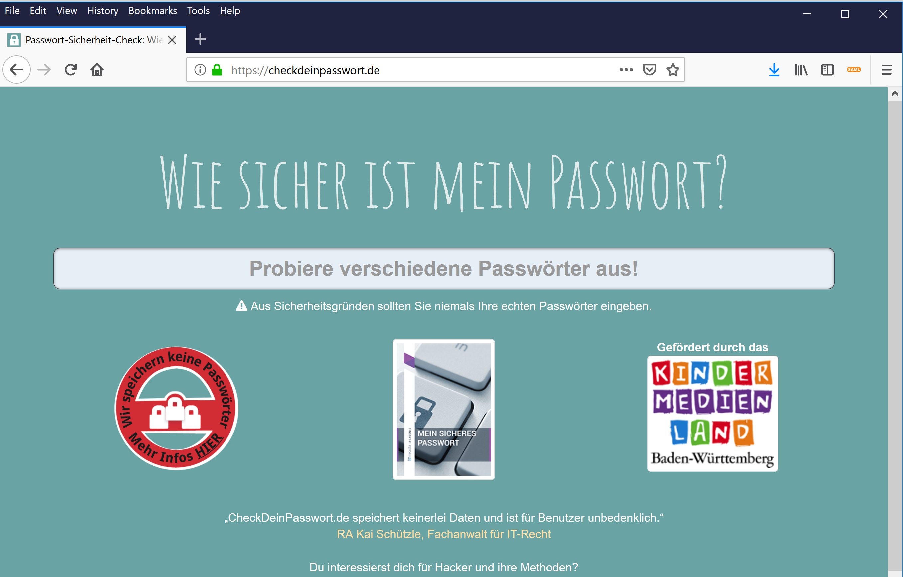
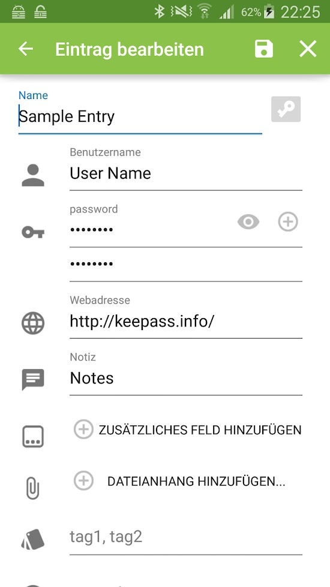
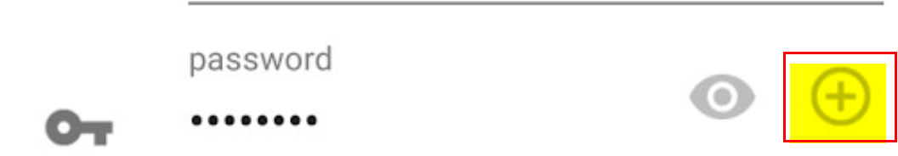

# Aufgabe 05: Wie gut ist (d)ein Passwort
## Einleitung
Ein gutes Passwort und überall ein anderes Passwort zu haben ist sehr wichtig! Doch wie wählt man ein gutes Passwort?

## Wie gut ist (d)ein Passwort?
* https://checkdeinpasswort.de/

Versuche die Anwendung einmal aus, aber vielleicht nicht mit Deinem echten Passwort, sondern einem frei erfundenen. 

## Lösung Passwort Manager
Du solltest Deine Passworte nicht in den Notizen von Deinem Handy speichern. Das ist sehr sehr unsicher!!! Nutze stattdessen einen Passwort Manager. 

Ein Passwort Manager ist ein Tool für den PC, Android, iPhone mit welchem man die verschiedenen Passworte für Gmail, Facebook, Twitter, Instagram, Snap, etc verwalten kann. Mit einem sehr guten Passwort, das man bei jedem Start des Tool eingeben muss, schaltet man die Anwendung frei und kann danach die weiteren Passworte abrufen und nutzen. 

Man kann mit dem Passwort Manager auch ein Passwort generieren, damit man sich nicht immer selbst ein gutes Passwort überlegen muss. 

Ein Passwort Manager hilft dabei, dass man lange, komplexe Passworte hat und idealerweise auch überall unterschiedliche Passworte. 

## Download KeePass
* https://keepass.info/download.html

Auf der obigen Seite siehst Du, für welches Betriebssystem und wo man KeePass für den PC, Android, iPhone bekommen kann. 

