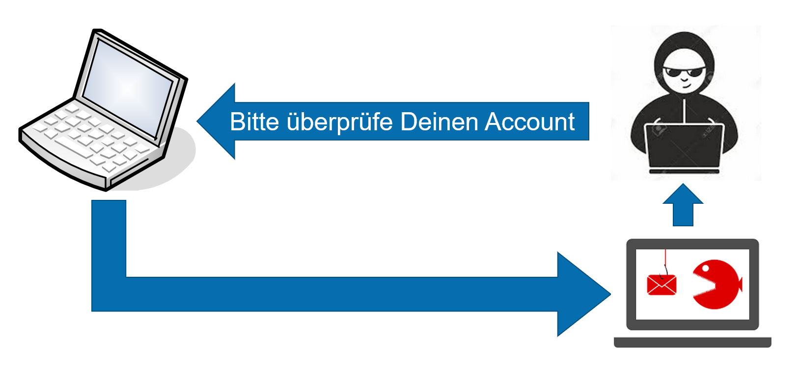

# Aufgabe 06: Phishing
## Einleitung
Phishing ist eine weit verbreitete Hacker Attacke um an Passwörter von Personen zu gelangen. Der Angreifer erstellt zuerst eine Kopie einer Webseite (z.B. Facebook) die so aussieht wie das Original. Danach lockt er mit Mails, Tweets, Posts etc. Leute auf diese Webseite, damit diese dort ihr Passwort eingeben. Meistens ist das Mail, Tweet, Post so geschrieben, wie wenn man etwas cooles gewinnen oder etwas ganz günstig kaufen kann. 

Phishing kann man technisch nicht wirklich verhindern. Je besser die Menschen einen Phishing Angriff erkennen, desto kleiner die Chance dass diese auf diesen fiesen Trick reinfallen. 

## Kannst Du Phishing erkennen?
Die Hochschule Luzern hat einen Phishing Test erstellt. Probier doch mal aus, wie gut Du Phishing Attacken erkennen kannst. Keine Angst, es ist keine Prüfung! Ist eine gute Übung! 

* https://www.ebas.ch/de/ihr-sicherheitsbeitrag/phishing/phishing-test

