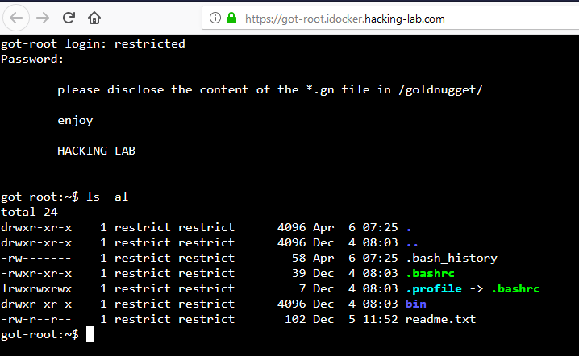

# Aufgabe 07: Got Root
## Einleitung
Bei dieser Übung schlüpfst Du in die Rolle des Hackers und Du sollst auf dem Server auf den Inhalt einer geheimen Datei zugreifen. 

`/goldnugget/goldnugget.gn`

Du bist aber auf dem Server in einem "Gefängnis" eingesperrt und musst dort zuerst ausbrechen. 


## Gefängnis == Restricted Shell
Bei dieser Aufgabe kannst Du auf einen Linux Server zugreifen. 

* https://got-root.idocker.hacking-lab.com/ 
* Username = restricted
* Password = restricted 
  
Dort angekommen, ist Deine Shell in einem Gefängnis gefangen und kann nicht auf das ganze Betriebssystem und Files zugreifen. 


Versuche aus dem Gefängnis auszubrechen `rbash breakout` und hol Dir den Inhalt der geheimen Datei `/goldnugget/goldnugget.gn`


## Screenshot nach dem Login



## Die wichtigsten Linux Kommandos für diese Aufgabe
```bash
cat             (anschauen von einem file)
ls              (listing von files)
ls -al          (listing von files mit auflistung berechtigungen)
ls -al bin      (listing des ordner "bin" mit berechtigungen)
echo "blabla"   (ausgabe von "blabla")
tee             (umlenkung der ausgabe auf bildschirm und in file)
|               (pipe = zwei befehle miteinander kombinieren)

HINT1 berechtigungen .bashrc
ls -al .bashrc

HINT2 überschreiben .bashrc mit etwas "eigenem"
echo "/bin/sh" | tee -a .bashrc

HINT3 ausloggen, neu einloggen nötig damit es aktiv wird
logout
login again
danach bist du zwar noch nicht root, aber aus dem gefängnis raus

HINT4 root werden
su - (passwort wird gefragt, aber wir kennen es noch nicht)
ls -al /home/restricted/.git 
cat /home/restricted/.git/config

```

## Erklärung zum Hack
Der Hack besteht aus 3 Schritten

1. Ausbruch aus dem Gefängnis (rbash breakout)
2. Via .git/config das root passwort herausfinden
3. root werden und `/goldnugget/goldnugget.gn` Datei auslesen

### Ausbruch aus dem Gefängnis
* Schaue Dir die Berechtigungen an (insbesondere von .bashrc)
* Was bewirkt die .bashrc? Mach Dich schlau bei Google
* Lerne den Befehl "tee" kennen (Nachlesen bei Google)
* Kombiniere diese Tipps und verlass das Gefängnis indem Du den Befehl "echo" mit der "|" und einer Datei kombinierst
* Du musst ausloggen und neu einloggen, damit dein Hack wirkt
* Danach solltest Du aus dem Gefängnis ausgebrochen sein

### via GIT das root Passwort herausfinden
* Du wirst eine .git Datei finden
* Was macht GIT? 
* Lerne das kennen und Du wirst das root Passwort via git finden

### Root werden mit dem Befehl `su -`
* Hack Dich weiter ... nutze das root Passwort um root zu werden
* Danach kannst Du die `/goldnugget/goldnugget.gn` Datei auslesen
* Nutze dazu den Befehl `cat /goldnugget/goldnugget.gn`
* fertig();

