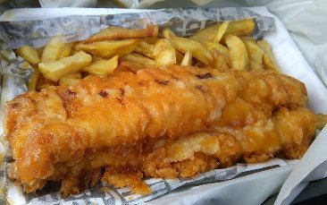

# Aufgabe 09: Fish & Chips
## Einleitung
Ein Hacker muss auch kreativ sein und querdenken können. Daher ist diese Aufgabe eher ein Rätsel als eine echte Hacker Aufgabe. Macht aber trotzdem Spass. Das Rätsel heisst "Fish & Chips" 

## Aufgabe
Was bedeutet die folgende geheime Nachricht?

Time for lunch. Hope you like the menu

`🍟 🐟🐟🐟🐟 🐟 🐟🐟🍟🐟 🐟🐟 🐟🐟🐟 🐟🐟🐟🐟 🍟🍟 🐟🐟🍟 🐟🐟🐟 🍟 🍟🐟🐟🐟 🐟 🐟🐟🐟🐟 🐟🍟 🍟🐟🐟 🍟🐟🐟 🍟🍟🍟 🍟🐟🍟🐟 🍟🐟🍟`

## Warum "Fish & Chips" ?
Es geht um die Frage, welchen Fisch der Koch normalerweise bei der englischen Speise "Fish & Chips" verwendet. Die Lösung steht in den obigen Zeichen geschrieben. 

## Hinweis 
Schau Dir die Zeichenfolge genau an. Was könnte das bedeuten? 

